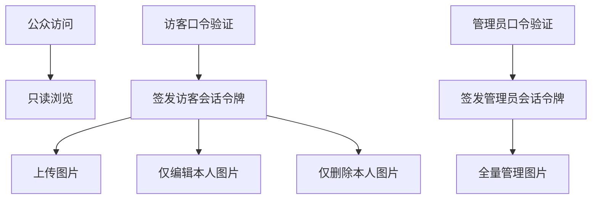

# 图床三层权限与低维护演进方案

> 适用项目：泠诗图床（Gallery & Uploader）
> 
> 目标：在不引入完整账号系统的前提下，实现三层权限与可持续演进

---

## 1. 产品定位

图床定位为：

- 公开端：类似 Pixiv 的美图鉴赏页面，只读浏览
- 访客端：输入访客口令后可上传，并且仅能管理自己上传的图片
- 管理端：输入管理员口令后可管理全部图片

核心原则：

1. 不做注册登录与找回密码，避免维护成本
2. 权限判断在 Worker 后端完成，前端仅做界面引导
3. 先建立安全基线，再做体验增强

---

## 2. 权限模型

### 2.1 角色定义

- Public 公众
  - 仅可浏览图片
  - 不可调用写接口

- Visitor 访客
  - 可上传图片
  - 可编辑自己上传图片的标题、分类、标签
  - 可删除自己上传图片
  - 不可修改他人图片

- Admin 管理员
  - 可编辑任意图片标题、分类、标签
  - 可删除任意图片
  - 可执行批量治理能力

### 2.2 访问流程



### 2.3 资源归属规则

每张图片元数据新增字段：

- ownerId：上传者标识
- createdByRole：visitor 或 admin
- createdAt：上传时间
- updatedAt：更新时间

权限判定：

- visitor 仅当 ownerId 命中时可修改或删除
- admin 不受 ownerId 限制

---

## 3. 当前设计缺陷复盘

结合 [`docs/gallery-dev-diary.md`](docs/gallery-dev-diary.md)、[`source/gallery/gallery.js`](source/gallery/gallery.js)、[`workers/gallery-presign/worker.js`](workers/gallery-presign/worker.js) 评估：

### 3.1 安全性

- 上传签名接口未限制角色，存在被滥用风险
- 管理口令在前端本地长期存储，存在泄露面
- 跨域放开范围过大，增加恶意请求触达概率

### 3.2 可靠性

- 列表接口单次返回上限，图库增大后可能漏图
- 图片移动是读写删三步，异常时存在一致性风险

### 3.3 可维护性

- 接口能力与文档有漂移，协作成本上升
- 分类配置硬编码，后续扩展需改前端代码

### 3.4 用户体验

- 多图上传元数据复用逻辑粗粒度
- 删除流程使用原生确认框，与站内交互风格不一致

---

## 4. 分阶段实施计划

## P0 权限重构与安全基线 必做

### 目标

建立三层权限闭环：公众只读、访客仅本人可管、管理员全量可管。

### 主要改动

后端 Worker：[`workers/gallery-presign/worker.js`](workers/gallery-presign/worker.js)

1. 新增登录与会话接口
   - loginVisitor 访客口令换令牌
   - loginAdmin 管理员口令换令牌
   - verifyToken 校验角色、过期时间
2. 改造写接口鉴权
   - sign 仅 visitor 或 admin 可调用
   - updateMeta moveImage deleteImage 统一做 RBAC 校验
3. 写入资源归属
   - 上传完成后写 ownerId createdByRole createdAt
4. 安全防护
   - CORS 白名单
   - key 前缀、扩展名、MIME 白名单校验

前端 Gallery：[`source/gallery/gallery.js`](source/gallery/gallery.js)、[`source/gallery/index.html`](source/gallery/index.html)

1. 默认只读，上传入口仅登录访客或管理员后显示
2. 使用会话令牌，不使用长期明文口令持久化
3. 按角色和 ownerId 控制编辑、删除按钮可见性

### 验收标准

- 未登录用户调用写接口必然失败
- visitor 仅能编辑删除自己上传图片
- admin 可管理全部图片
- public 浏览链路不受影响

### 回滚要点

- 为新鉴权路径保留开关，可临时回退到管理员单通道写权限

---

## P1 数据一致性与性能 必做

### 目标

保障图库规模增长后仍可完整加载、稳定写入。

### 主要改动

后端 Worker：[`workers/gallery-presign/worker.js`](workers/gallery-presign/worker.js)

1. list 支持分页 continuation token
2. metadata 增加版本戳，写入采用乐观并发控制
3. moveImage 增加失败补偿与幂等策略

前端 Gallery：[`source/gallery/gallery.js`](source/gallery/gallery.js)

1. 主列表支持增量加载
2. 分类计数并行拉取并带失败重试

### 验收标准

- 图片量超过单页上限仍可完整浏览
- 并发上传下 metadata 无明显覆盖丢失
- 分类切换响应稳定

### 回滚要点

- 保留旧 list 读取分支开关，异常时可降级单页读取

---

## P2 Pixiv 风格鉴赏与治理增强 建议

### 目标

强化鉴赏体验与管理效率，形成浏览与治理闭环。

### 功能清单

1. 标题标签搜索
2. 标签云筛选
3. 批量移动批量删除 仅管理员
4. 访客 我的上传 视图
5. BlurHash 解码占位图

### 验收标准

- 支持 浏览 搜索 筛选 上传 管理 的完整链路
- 管理动作可在单页完成

---

## P3 可观测性与运营能力 可选

### 目标

提升问题定位速度和长期运营稳定性。

### 功能清单

1. 写操作审计日志
2. 关键接口错误率监控
3. 异常峰值告警

---

## 5. 接口草案

统一建议：前缀 `/api/gallery`，返回结构保持 `{ code, message, data }`。

- `POST /loginVisitor`
- `POST /loginAdmin`
- `GET /list`
- `POST /sign`
- `POST /updateMeta`
- `POST /moveImage`
- `DELETE /deleteImage`

其中：

- 写接口必须校验 Bearer 令牌
- `updateMeta moveImage deleteImage` 必须带资源归属校验

---

## 6. 数据结构草案

```json
{
  "img/gallery/二次元/xxx.jpg": {
    "title": "示例标题",
    "tags": ["二次元", "插画"],
    "ownerId": "visitor_abc123",
    "createdByRole": "visitor",
    "createdAt": "2026-02-23T16:00:00.000Z",
    "updatedAt": "2026-02-23T16:10:00.000Z",
    "version": 3
  }
}
```

---

## 7. 明日开发建议顺序

1. 先完成 P0 的 Worker 鉴权骨架
2. 再接前端会话和按钮权限
3. 最后补 P1 分页与一致性
4. P2 功能按体验优先级逐步打开

---

## 8. 风险与取舍

- 不做完整账号系统，维护成本最低，但无法提供用户自助找回与跨端身份绑定
- 双口令模式适合当前阶段，后续如果上传用户增长明显，再升级到轻账号体系

---

## 9. 结论

推荐路线：

- 现在采用 双口令 + 会话令牌 + 资源归属校验
- 保持低维护与足够权限隔离
- 用 P0 P1 打稳底座，再做 P2 的鉴赏体验

该方案可在当前项目结构下平滑落地，且与现有图床架构兼容。