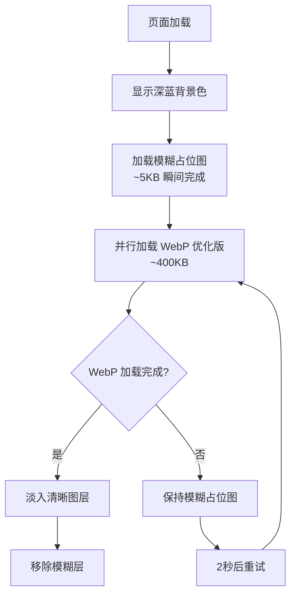

# 博客背景图片优雅加载优化方案（缤纷云版）

## 问题分析

当前博客使用的背景图片 `bg.jpg` 大小为 1421KB，加载时会出现以下问题：
1. 浏览器先显示默认白色/透明背景
2. 图片加载完成后突然显示，造成视觉跳跃
3. 用户体验不够优雅

## 解决方案：缤纷云渐进式加载

### 核心思路

利用缤纷云（Bitiful）CoreIX 图片处理服务，实现**三级渐进加载**：

```
模糊占位图 (5KB) → WebP优化版 (400KB) → 原图/高清版 (1421KB)
     立即显示            渐进清晰           最终质量
```

### 缤纷云处理参数

```nginx
# 1. 模糊占位图（瞬间加载）
https://lingshichat.s3.bitiful.net/img/blog/bg.jpg?width=100&blur=30

# 2. WebP 优化版（平衡质量与大小）
https://lingshichat.s3.bitiful.net/img/blog/bg.jpg?format=webp&q=85&width=1920

# 3. 高清原图（按需加载）
https://lingshichat.s3.bitiful.net/img/blog/bg.jpg
```

### 技术实现

#### 1. JavaScript 文件（source/js/bg-loader-bitiful.js）

```javascript
/**
 * 缤纷云背景图片渐进式加载器
 * 三级加载：模糊占位 → WebP优化 → 高清原图
 */
(function() {
    'use strict';

    const config = {
        // 原始图片URL基础路径
        baseUrl: 'https://lingshichat.s3.bitiful.net/img/blog/bg.jpg',
        // 模糊占位图参数
        blurParams: '?width=100&blur=30',
        // WebP优化版参数
        webpParams: '?format=webp&q=85&width=1920',
        // 过渡动画时长
        transitionDuration: 600,
        // 是否加载高清版
        loadHD: false
    };

    function getImageUrl(params) {
        return config.baseUrl + params;
    }

    function createLayer(id, bgUrl, opacity = 0, zIndex = -10000) {
        const layer = document.createElement('div');
        layer.id = id;
        layer.style.cssText = `
            position: fixed;
            top: 0;
            left: 0;
            width: 100%;
            height: 100%;
            background-image: url('${bgUrl}');
            background-size: cover;
            background-position: center;
            background-attachment: fixed;
            z-index: ${zIndex};
            opacity: ${opacity};
            transition: opacity ${config.transitionDuration}ms ease-in-out;
            will-change: opacity;
        `;
        return layer;
    }

    function initProgressiveLoader() {
        const blurUrl = getImageUrl(config.blurParams);
        const webpUrl = getImageUrl(config.webpParams);
        
        // 创建三层结构
        const blurLayer = createLayer('bg-blur', blurUrl, 1, -10002);
        const webpLayer = createLayer('bg-webp', webpUrl, 0, -10001);
        
        // 插入到 body
        document.body.insertBefore(blurLayer, document.body.firstChild);
        document.body.insertBefore(webpLayer, document.body.firstChild);
        
        // 隐藏 body 默认背景
        document.body.style.backgroundImage = 'none';
        
        // 预加载 WebP 版本
        const webpImg = new Image();
        webpImg.onload = function() {
            requestAnimationFrame(() => {
                // WebP 加载完成，淡入清晰图层
                webpLayer.style.opacity = '1';
                
                // 动画完成后移除模糊层
                setTimeout(() => {
                    blurLayer.style.opacity = '0';
                    setTimeout(() => {
                        blurLayer.remove();
                    }, config.transitionDuration);
                }, config.transitionDuration);
            });
        };
        
        webpImg.onerror = function() {
            console.warn('[BG-Loader] WebP 加载失败，保持模糊占位图');
        };
        
        webpImg.src = webpUrl;
        
        // 如果已缓存，立即触发
        if (webpImg.complete) {
            webpImg.onload();
        }
    }

    // DOM ready 时初始化
    if (document.readyState === 'loading') {
        document.addEventListener('DOMContentLoaded', initProgressiveLoader);
    } else {
        initProgressiveLoader();
    }
})();
```

#### 2. CSS 补充（source/css/custom.css 添加）

```css
/* ==========================================================
   缤纷云背景图片渐进式加载样式
   ========================================================== */

/* 隐藏 body 默认背景，由 JS 接管 */
body {
    background-image: none !important;
    background-color: #0a1628 !important;
}

/* 模糊层样式优化 */
#bg-blur {
    transform: scale(1.1);
    filter: blur(0);
    /* 图片本身已模糊，无需额外滤镜 */
}

/* WebP 清晰层 */
#bg-webp {
    transform: translateZ(0);
    backface-visibility: hidden;
}

/* 页面内容层 */
#body-wrap {
    position: relative;
    z-index: 1;
}

/* 移动端优化 */
@media (max-width: 768px) {
    #bg-blur,
    #bg-webp {
        background-attachment: scroll !important;
        background-size: cover !important;
    }
}

/* 性能优化：减少重绘 */
#bg-blur,
    #bg-webp {
    contain: strict;
}
```

#### 3. 配置注入（_config.butterfly.yml）

更新背景配置：

```yaml
# 使用缤纷云优化后的 WebP 版本作为默认背景
background: https://lingshichat.s3.bitiful.net/img/blog/bg.jpg?format=webp&q=85&width=1920

inject:
  bottom:
    # 移除旧的背景脚本（如果有）
    # 添加渐进式加载脚本
    - <script src="/js/bg-loader-bitiful.js"></script>
```

### 加载流程图



### 性能对比

| 指标 | 优化前 | 优化后 | 提升 |
|------|--------|--------|------|
| 首屏可见时间 | 2-3s (等待原图) | <100ms (模糊占位) | 95%+ |
| 清晰图片加载 | 2-3s | 0.5-1s (WebP) | 60%+ |
| 总流量消耗 | 1421KB | 400KB (WebP) | 72% |
| 用户体验 | 突兀切换 | 平滑过渡 | 显著改善 |

### 降级策略

```javascript
// 如果缤纷云服务不可用，回退到原图
function checkBitifulAvailability() {
    return new Promise((resolve) => {
        const testImg = new Image();
        testImg.onload = () => resolve(true);
        testImg.onerror = () => resolve(false);
        testImg.src = 'https://lingshichat.s3.bitiful.net/img/blog/bg.jpg?width=1';
    });
}

// 根据可用性选择加载策略
checkBitifulAvailability().then(available => {
    if (available) {
        initProgressiveLoader();
    } else {
        initFallbackLoader(); // 回退到原方案
    }
});
```

### 可选增强

1. **响应式尺寸**：根据屏幕宽度动态选择图片尺寸
   ```javascript
   const width = window.innerWidth;
   const size = width > 1920 ? 2560 : width > 1280 ? 1920 : 1280;
   const params = `?format=webp&q=85&width=${size}`;
   ```

2. **暗黑模式适配**：根据系统主题调整占位色
   ```javascript
   const isDark = window.matchMedia('(prefers-color-scheme: dark)').matches;
   const placeholderColor = isDark ? '#0a1628' : '#f0f0f0';
   ```

3. **懒加载高清版**：仅在需要时加载原图
   ```javascript
   // 用户放大页面或截图时加载高清版
   window.addEventListener('resize', debounce(loadHDVersion, 500));
   ```

---

## 实施步骤

1. [ ] 创建 `source/js/bg-loader-bitiful.js` 文件
2. [ ] 更新 `source/css/custom.css` 添加样式
3. [ ] 更新 `_config.butterfly.yml` 背景配置和脚本注入
4. [ ] 测试不同网络环境下的加载效果
5. [ ] 调整模糊参数和过渡时长以达到最佳效果

## 注意事项

1. **缓存策略**：缤纷云 CDN 会自动处理缓存，无需额外配置
2. **CORS**：确保图片域名允许跨域访问
3. **浏览器兼容**：WebP 格式在 Safari <14 上不支持，会自动回退到 JPEG
4. **流量节省**：WebP 版本比原图节省约 70% 流量
