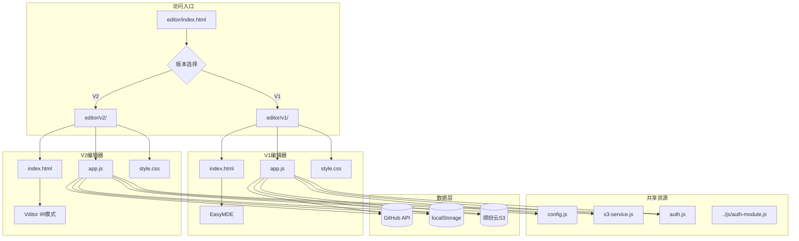

# Editor V2 即时渲染编辑器方案

## 📋 项目概述

将现有的 [`source/editor/prototype/`](source/editor/prototype/) 中的 Vditor 即时渲染原型，升级为与 V1 编辑器（EasyMDE）**独立但数据互通**的 V2 正式版本。

### 核心目标
- ✅ 保留 V1 编辑器的完整功能（作为备选）
- ✅ V2 采用 Vditor 即时渲染模式，提供 Typora 般的编辑体验
- ✅ V1 和 V2 共享同一套数据源（GitHub API、localStorage）
- ✅ 用户可在两个版本间无缝切换

---

## 🏗️ 架构设计

### 共存方案



### 文件结构

```
source/editor/
├── index.html              # 入口页面：版本选择器
├── config.js               # 共享配置（已存在）
├── s3-service.js           # 图床服务（已存在）
├── auth.js                 # 认证模块（已存在）
│
├── v1/                     # V1 编辑器（原 editor 内容）
│   ├── index.html          # EasyMDE 编辑器页面
│   ├── app.js              # V1 Vue 应用逻辑
│   └── style.css           # V1 样式
│
└── v2/                     # V2 编辑器（Vditor 即时渲染）
    ├── index.html          # Vditor 编辑器页面
    ├── app.js              # V2 Vue 应用逻辑
    └── style.css           # V2 样式（适配 Glass 风格）
```

---

## 🔗 数据互通机制

### 1. localStorage 共享

| 存储键 | 说明 | V1/V2 兼容 |
|--------|------|-----------|
| `blog_editor_token` | GitHub Token | ✅ 完全兼容 |
| `auth_session` | 共享登录会话 | ✅ 完全兼容 |
| `blog_draft` | V1 自动保存草稿 | ⚠️ V2 使用不同 key |
| `blog_draft_v2` | V2 自动保存草稿 | ⚠️ V2 独立存储 |
| `editor_preference_version` | 用户偏好的编辑器版本 | ✅ 新增 |

### 2. GitHub API 数据

- **文章列表**: 共享 `source/_posts` 目录
- **回收站**: 共享 `source/_trash` 目录
- **Front Matter 格式**: 保持完全一致

### 3. 版本切换流程

```javascript
// 入口页面逻辑 (editor/index.html)
function checkEditorPreference() {
    const preferredVersion = localStorage.getItem('editor_preference_version');
    const lastUsedVersion = localStorage.getItem('editor_last_used_version');
    
    // 首次访问：显示版本选择弹窗
    if (!preferredVersion) {
        showVersionSelector();
        return;
    }
    
    // 跳转到偏好版本
    window.location.href = `./${preferredVersion}/index.html`;
}

// 版本切换时保留当前编辑状态
function switchVersion(targetVersion) {
    // 保存当前草稿
    saveCurrentDraft();
    
    // 记录切换时间戳，用于另一版本检测
    localStorage.setItem('editor_switch_timestamp', Date.now());
    
    // 跳转
    window.location.href = `../${targetVersion}/index.html`;
}
```

---

## 🎯 V2 编辑器功能规划

### 核心功能（继承 V1）

| 功能 | V1 实现 | V2 实现 | 状态 |
|------|---------|---------|------|
| GitHub 登录 | EasyMDE + 自定义 | Vditor + 复用 auth.js | ✅ 复用 |
| 文章列表 | 侧边栏 | 侧边栏（保持一致） | ✅ 复用 UI |
| 新建/编辑/删除 | Vue 方法 | Vue 方法（适配 Vditor API） | 🔄 需改造 |
| Front Matter 编辑 | 表单输入 | 表单输入（保持一致） | ✅ 复用 |
| 图床上传 | S3 服务 | S3 服务（复用） | ✅ 复用 |
| 回收站 | 完整实现 | 复用 V1 逻辑 | ✅ 复用 |
| 自动保存 | EasyMDE 内置 | Vditor cache + 手动备份 | 🔄 需适配 |

### Vditor 特有功能

| 功能 | 说明 |
|------|------|
| 即时渲染模式 | 类似 Typora 的实时预览体验 |
| 大纲导航 | 自动生成文章目录 |
| 数学公式 | KaTeX 支持 |
| 流程图/甘特图 | Mermaid 支持 |
| 代码块高亮 | highlight.js 集成 |

### Hexo Tag 支持

V2 需要继续支持 Hexo 标签的即时渲染：

```javascript
// Vditor preview 钩子中处理 Hexo Tags
preview: {
    markdown: {
        render: (text) => {
            // 1. 标准 Markdown 渲染
            let html = vditor.lute.RenderMarkdownStr(text);
            
            // 2. Hexo Tag 转换
            html = renderHexoTags(html);
            
            return html;
        }
    }
}

// 支持的标签
//  -> APlayer 播放器
//  -> 样式化按钮
//  -> 提示框
//  -> 图片画廊
```

---

## 📁 详细实施步骤

### 阶段一：目录重构（第 1 步）

1. **创建 V1 目录**
   ```bash
   mkdir -p source/editor/v1
   ```

2. **迁移现有文件到 V1**
   - `source/editor/index.html` → `source/editor/v1/index.html`
   - `source/editor/app.js` → `source/editor/v1/app.js`
   - `source/editor/style.css` → `source/editor/v1/style.css`

3. **更新 V1 文件中的路径**
   - CSS/JS 引用路径调整
   - 共享资源路径：`../config.js`、`../s3-service.js`

### 阶段二：创建入口页面（第 2 步）

新的 `source/editor/index.html`：
- 版本选择界面（Glass 风格）
- 记住用户偏好
- 自动跳转到上次使用的版本

### 阶段三：开发 V2 编辑器（第 3-5 步）

基于 [`prototype/index.html`](source/editor/prototype/index.html) 进行改造：

1. **整合 Vue 2 框架**
2. **复用 V1 的 UI 组件**
   - 登录界面
   - 侧边栏文章列表
   - Front Matter 编辑表单
   - 图床模态框
3. **适配 Vditor API**
   - 初始化配置
   - 工具栏定制
   - 图片上传集成
4. **实现 Hexo Tag 渲染**

### 阶段四：数据互通实现（第 6 步）

1. **统一 localStorage key 规范**
2. **版本切换时草稿同步**
3. **测试双向切换**

### 阶段五：测试与优化（第 7-8 步）

---

## 🎨 UI/UX 设计

### 版本选择界面

```
┌─────────────────────────────────────────┐
│                                         │
│      ✍️ 选择你的编辑器                   │
│                                         │
│   ┌─────────────┐   ┌─────────────┐    │
│   │   V1 经典   │   │   V2 即时   │    │
│   │             │   │             │    │
│   │  EasyMDE   │   │   Vditor   │    │
│   │             │   │             │    │
│   │ • 分栏预览  │   │ • 即时渲染  │    │
│   │ • 稳定可靠  │   │ • 所见即所得│    │
│   │ • 传统体验  │   │ • 现代流畅  │    │
│   │             │   │             │    │
│   │ [ 进入 V1 ] │   │ [ 进入 V2 ] │    │
│   └─────────────┘   └─────────────┘    │
│                                         │
│   [✓] 记住我的选择                      │
│                                         │
└─────────────────────────────────────────┘
```

### V2 编辑器布局

保持与 V1 一致的 Glass 风格：
- 深色玻璃拟态背景
- 相同的配色方案
- 统一的动画效果
- 响应式布局

---

## ⚠️ 风险与注意事项

### 技术风险

1. **Vditor 与现有样式冲突**
   - **缓解措施**: 使用 CSS 命名空间隔离
   
2. **Hexo Tag 渲染性能**
   - **缓解措施**: 防抖处理 + 缓存机制

3. **数据同步延迟**
   - **缓解措施**: 版本切换时显式保存草稿

### 用户体验

1. **学习成本**: V2 操作方式与 V1 不同
   - **缓解措施**: 提供首次使用引导

2. **版本选择困扰**: 新用户不知道选哪个
   - **缓解措施**: 推荐 V2（默认选中），保留 V1 作为"经典模式"

---

## ✅ 验收标准

- [ ] V1 编辑器完整迁移到新目录，功能正常
- [ ] V2 编辑器基于 Vditor 实现即时渲染
- [ ] 入口页面可以正确选择并跳转到对应版本
- [ ] 两个版本共享登录状态和 Token
- [ ] 文章列表、编辑、保存、删除功能在两个版本中一致
- [ ] 图床功能在两个版本中正常工作
- [ ] 版本切换时不会丢失未保存的草稿
- [ ] 移动端适配正常

---

## 🚀 下一步行动

1. 确认本方案后，开始实施阶段一（目录重构）
2. 逐步完成各阶段开发
3. 在测试环境验证后部署
