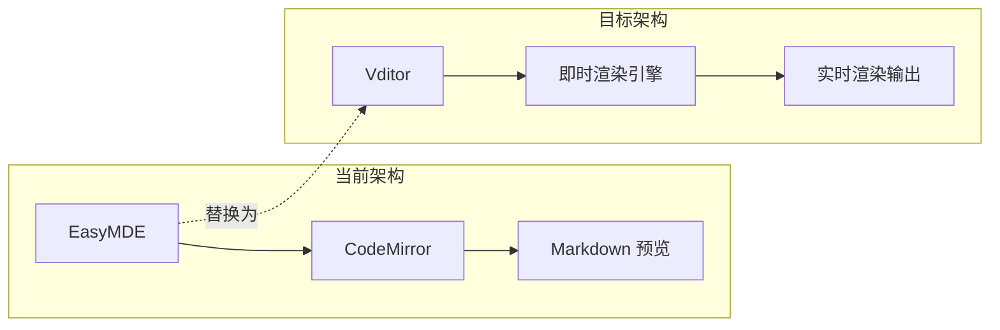

# Editor 即时渲染改造方案

## 📋 目标

将当前基于 EasyMDE 的传统分栏编辑器，改造为类似 **Typora 的即时渲染 (Instant Rendering)** 体验。

## 🔍 当前架构分析

### 现有技术栈
- **编辑器**: EasyMDE (基于 CodeMirror 6)
- **框架**: Vue 2.6.14
- **Markdown 渲染**: EasyMDE 内置渲染器
- **特殊功能**: 
  - Hexo Tag 支持 (``, ``)
  - 图床上传 (S3/Cloudflare R2)
  - 自动保存
  - 双栏预览模式

### 核心文件
- [`source/editor/index.html`](source/editor/index.html) - 编辑器页面结构
- [`source/editor/app.js`](source/editor/app.js) - Vue 应用逻辑 (约 1000 行)
- [`source/editor/style.css`](source/editor/style.css) - 样式文件 (约 2800 行)

---

## 🛠️ 技术方案对比

### 方案一：Vditor (推荐)

**官网**: https://b3log.org/vditor/

**特点**:
- 🎯 **原生支持即时渲染模式** - 类似 Typora 的体验
- 🇨🇳 国人开发，中文文档完善
- 🔌 支持 Math/KaTeX、流程图、甘特图等
- 📦 支持多种模式切换（所见即所得、即时渲染、分屏预览）
- 🎨 可定制主题

**优点**:
```javascript
// 初始化示例
new Vditor('vditor', {
  mode: 'instant',  // 即时渲染模式！
  cache: { enable: true },
  after: () => { /* 初始化完成 */ }
})
```

**缺点**:
- 需要适配现有的 Hexo Tag 语法
- 需要重新实现图床上传逻辑

**迁移复杂度**: ⭐⭐⭐ (中等)

---

### 方案二：Milkdown

**官网**: https://milkdown.dev/

**特点**:
- 🚀 基于 ProseMirror 的现代编辑器
- 🧩 插件化架构，高度可定制
- 📝 WYSIWYG 编辑体验
- 🎯 TypeScript 原生支持

**优点**:
- 现代化架构，可扩展性强
- 社区活跃，维护良好

**缺点**:
- 学习曲线较陡
- 需要配置较多插件才能达到完整功能
- 文档偏英文

**迁移复杂度**: ⭐⭐⭐⭐ (较高)

---

### 方案三：Cherry Markdown

**官网**: https://tencent.github.io/cherry-markdown/

**特点**:
- 🏢 腾讯开源
- 📋 支持多种编辑模式（纯文本、即时渲染、WYSIWYG）
- 🔧 内置丰富工具栏
- 🎨 多主题支持

**优点**:
- 即时渲染模式成熟
- 中文文档
- 内置图片上传功能

**缺点**:
- 包体积较大
- Hexo Tag 需要自定义

**迁移复杂度**: ⭐⭐⭐ (中等)

---

### 方案四：Toast UI Editor

**官网**: https://ui.toast.com/tui-editor

**特点**:
- 🔄 支持 Markdown / WYSIWYG 模式切换
- 📦 功能全面
- 🎨 可定制

**优点**:
- 成熟稳定
- 双模式切换方便

**缺点**:
- 即时渲染体验不如 Vditor
- 风格偏向传统编辑器

**迁移复杂度**: ⭐⭐⭐ (中等)

---

## 📊 方案对比表

| 特性 | Vditor | Milkdown | Cherry | Toast UI |
|------|--------|----------|--------|----------|
| 即时渲染 | ✅ 优秀 | ✅ 优秀 | ✅ 良好 | ⚠️ 一般 |
| 中文支持 | ✅ 完善 | ⚠️ 英文 | ✅ 完善 | ⚠️ 英文 |
| 学习曲线 | 低 | 高 | 中 | 中 |
| 体积 | ~200KB | ~150KB | ~300KB | ~200KB |
| Vue 2 兼容 | ✅ | ⚠️ 需要 wrapper | ✅ | ✅ |
| Hexo Tag 扩展 | 需定制 | 需定制 | 需定制 | 需定制 |
| 维护状态 | 活跃 | 活跃 | 活跃 | 活跃 |

---

## ✅ 推荐方案：Vditor

### 选择理由

1. **即时渲染模式原生支持** - 完美符合需求
2. **国产开源** - 中文文档，社区支持
3. **Vue 2 兼容性好** - 无需额外 wrapper
4. **功能完整** - 工具栏、快捷键、自动保存都有
5. **迁移成本可控** - API 简单

### 迁移架构图



---

## 🚀 实施步骤

### 阶段一：基础迁移

1. **引入 Vditor**
   ```html
   <link rel="stylesheet" href="https://unpkg.com/vditor/dist/index.css" />
   <script src="https://unpkg.com/vditor/dist/index.min.js"></script>
   ```

2. **修改 HTML 结构**
   - 移除 EasyMDE 的 textarea
   - 添加 Vditor 容器

3. **初始化 Vditor**
   ```javascript
   initVditor() {
     this.vditor = new Vditor('vditor', {
       mode: 'instant',
       cache: { enable: true, id: 'blog_draft' },
       toolbar: this.getToolbarConfig(),
       upload: this.getUploadConfig(),
       after: () => this.onVditorReady()
     })
   }
   ```

### 阶段二：功能适配

4. **适配 Hexo Tag 渲染**
   ```javascript
   // 自定义渲染器
   preview: {
     markdown: (text) => {
       return this.renderHexoTags(text);
     }
   }
   ```

5. **图床上传集成**
   ```javascript
   upload: {
     handler: (files) => this.handleImageUpload(files),
     format: (files, responseText) => this.formatUploadResponse(responseText)
   }
   ```

6. **自动保存逻辑迁移**

### 阶段三：UI/UX 优化

7. **样式适配** - 与现有 Glass 风格统一
8. **快捷键映射** - 保持用户习惯
9. **移动端适配**

### 阶段四：测试与发布

10. **功能测试**
11. **兼容性测试**
12. **灰度发布**

---

## ⚠️ 注意事项

1. **Hexo Tag 兼容性**
   - Vditor 的 preview 钩子需要处理 `` 等标签
   - 可能需要使用正则替换或自定义渲染器

2. **图片上传**
   - 当前 S3 服务逻辑需要适配 Vditor 的 upload API

3. **数据迁移**
   - EasyMDE 的自动保存数据格式可能需要转换

4. **样式冲突**
   - Vditor 自带样式可能与现有 CSS 冲突
   - 需要使用 CSS 命名空间隔离

---

## 📁 需要修改的文件

| 文件 | 改动程度 | 说明 |
|------|----------|------|
| `index.html` | 🔴 大 | 引入 Vditor，修改编辑器容器 |
| `app.js` | 🔴 大 | 重构编辑器初始化和事件处理 |
| `style.css` | 🟡 中 | 添加 Vditor 样式覆盖 |
| `config.js` | 🟢 小 | 可能需要添加 Vditor 配置 |

---

## 🎉 迁移状态：已完成

**完成时间**: 2026-02-20

**改动文件**:
- [`source/editor/index.html`](source/editor/index.html) - 引入 Vditor，移除 EasyMDE
- [`source/editor/app.js`](source/editor/app.js) - 重构编辑器初始化，适配 Vditor API
- [`source/editor/style.css`](source/editor/style.css) - 添加 Vditor 样式覆盖

---

## ✅ 已确认的方案细则

根据需求确认，本次迁移遵循以下原则：

| 决策项 | 选择 | 说明 |
|--------|------|------|
| Hexo Tag 渲染 | 即时渲染完全渲染标签效果 | 在编辑时直接显示 ``, `` 等标签的渲染效果 |
| 双栏预览模式 | 不保留 | 完全依赖 Vditor 的即时渲染体验，简化 UI |
| 图床上传 | 继续使用现有 S3 服务 | 复用 [`s3-service.js`](source/editor/s3-service.js) 的上传逻辑 |

---

## 🔧 详细实施计划

### 阶段一：基础迁移

#### 1.1 引入 Vditor 资源

**修改文件**: [`source/editor/index.html`](source/editor/index.html)

```html
<!-- 移除 EasyMDE -->
- <link rel="stylesheet" href="https://unpkg.com/easymde/dist/easymde.min.css">
- <script src="https://unpkg.com/easymde/dist/easymde.min.js"></script>

<!-- 添加 Vditor -->
+ <link rel="stylesheet" href="https://unpkg.com/vditor/dist/index.css" />
+ <script src="https://unpkg.com/vditor/dist/index.min.js"></script>
```

#### 1.2 修改编辑器容器

**修改文件**: [`source/editor/index.html`](source/editor/index.html)

```html
<!-- 移除 EasyMDE textarea -->
- <textarea id="markdown-editor"></textarea>

<!-- 添加 Vditor 容器 -->
+ <div id="vditor" class="vditor-container"></div>
```

#### 1.3 重构编辑器初始化

**修改文件**: [`source/editor/app.js`](source/editor/app.js)

```javascript
// 移除 EasyMDE 相关
- easyMDE: null,
+ vditor: null,

// 新增 Vditor 初始化方法
initVditor() {
  this.vditor = new Vditor('vditor', {
    mode: 'instant',  // 即时渲染模式
    cache: {
      enable: true,
      id: 'blog_draft'
    },
    toolbar: this.getVditorToolbar(),
    preview: {
      markdown: (text) => this.renderHexoContent(text)
    },
    upload: {
      handler: (files) => this.handleVditorUpload(files),
      format: (files, responseText) => responseText
    },
    after: () => {
      // 恢复自动保存的内容
      this.loadDraftContent();
    }
  });
}
```

#### 1.4 移除双栏预览相关代码

**需要移除的功能**:
- `splitMode` 状态变量
- `toggleSplitMode()` 方法
- `updateSplitPreview()` 方法
- 工具栏中的双栏预览按钮
- 分屏预览的 DOM 结构

---

### 阶段二：功能适配

#### 2.1 Hexo Tag 即时渲染

**核心实现**: 在 Vditor 的 `preview.markdown` 钩子中处理 Hexo 标签

```javascript
preview: {
  markdown: (text) => {
    return this.renderHexoTags(text);
  }
}

// 增强版 Hexo Tag 渲染
renderHexoTags(text) {
  // 1. 处理  音乐标签
  text = text.replace(/{%\s*meting\s+([^%]+)%}/g, (match, params) => {
    return this.renderMetingTag(params);
  });
  
  // 2. 处理  按钮标签
  text = text.replace(/{%\s*btn\s+([^%]+)%}/g, (match, params) => {
    return this.renderBtnTag(params);
  });
  
  // 3. 其他 Hexo 标签...
  
  return text;
}
```

**支持的 Hexo Tags**:
| 标签 | 渲染效果 |
|------|----------|
| `` | 显示 APlayer 音乐播放器 |
| `` | 显示样式化按钮 |
| `` | 显示提示框 |
| `` | 显示图片画廊 |

#### 2.2 S3 图床上传集成

**复用现有服务**: [`source/editor/s3-service.js`](source/editor/s3-service.js)

```javascript
async handleVditorUpload(files) {
  const file = files[0];
  if (!file) return;
  
  try {
    // 使用现有的 S3 服务上传
    const url = await s3Service.uploadImage(file);
    
    // 返回 Vditor 要求的格式
    return JSON.stringify({
      msg: '',
      code: 0,
      data: {
        errFiles: [],
        succMap: {
          [file.name]: url
        }
      }
    });
  } catch (error) {
    console.error('Upload failed:', error);
    return JSON.stringify({
      msg: error.message,
      code: 1,
      data: { errFiles: [file.name], succMap: {} }
    });
  }
}
```

#### 2.3 自动保存逻辑迁移

```javascript
// Vditor 内置缓存机制
cache: {
  enable: true,
  id: 'blog_draft'  // 与 EasyMDE 使用相同的缓存 key
}

// 手动保存到 GitHub 的逻辑保持不变
async savePost() {
  const content = this.vditor.getValue();
  // ... 现有保存逻辑
}
```

---

### 阶段三：UI/UX 优化

#### 3.1 样式适配

**修改文件**: [`source/editor/style.css`](source/editor/style.css)

```css
/* Vditor 容器样式 - 适配 Glass 风格 */
.vditor-container {
  border: none;
  border-radius: 12px;
  background: rgba(255, 255, 255, 0.8);
  backdrop-filter: blur(10px);
  box-shadow: 0 8px 32px rgba(0, 0, 0, 0.1);
}

/* 覆盖 Vditor 默认主题色 */
.vditor {
  --border-color: rgba(255, 255, 255, 0.3);
  --toolbar-background: rgba(255, 255, 255, 0.9);
}

/* 即时渲染区域样式 */
.vditor-ir {
  font-family: 'LXGW WenKai', sans-serif;
  line-height: 1.8;
}
```

#### 3.2 工具栏配置

```javascript
getVditorToolbar() {
  return [
    'headings', 'bold', 'italic', 'strike',
    '|', 'line', 'quote', 'list', 'code', 'inline-code',
    '|', 'link', 'table',
    {
      name: 'upload',
      tip: '上传图片',
      icon: '<svg>...</svg>',
      click: () => this.openImageGallery()
    },
    '|',
    {
      name: 'fullscreen',
      tip: '沉浸模式',
      icon: '<svg>...</svg>',
      click: () => this.toggleFullscreen()
    }
  ];
}
```

#### 3.3 移动端适配

```css
/* 移动端响应式 */
@media (max-width: 768px) {
  .vditor-container {
    border-radius: 0;
    height: calc(100vh - 120px);
  }
  
  .vditor-toolbar {
    flex-wrap: wrap;
  }
}
```

---

### 阶段四：测试与发布

#### 4.1 功能测试清单

- [ ] 基础 Markdown 语法渲染
- [ ] Hexo Tag 即时渲染效果
  - [ ] `` 音乐播放器
  - [ ] `` 按钮
  - [ ] `` 提示框
- [ ] 图片上传功能
  - [ ] 拖拽上传
  - [ ] 点击上传
  - [ ] 图库选择
- [ ] 自动保存与恢复
- [ ] GitHub 保存/更新文章
- [ ] 沉浸模式
- [ ] 移动端适配

#### 4.2 兼容性测试

| 浏览器 | 版本要求 |
|--------|----------|
| Chrome | 80+ |
| Firefox | 75+ |
| Safari | 13+ |
| Edge | 80+ |

#### 4.3 发布流程

1. 创建 `feature/vditor-migration` 分支
2. 完成各阶段开发与测试
3. 合并到主分支前进行 Code Review
4. 部署到测试环境验证
5. 正式发布

---

## 📁 文件改动清单

| 文件 | 改动类型 | 改动内容 |
|------|----------|----------|
| [`source/editor/index.html`](source/editor/index.html) | 🔴 大改 | 引入 Vditor，移除 EasyMDE，修改编辑器容器 |
| [`source/editor/app.js`](source/editor/app.js) | 🔴 大改 | 重构编辑器初始化，移除双栏预览，适配 Vditor API |
| [`source/editor/style.css`](source/editor/style.css) | 🟡 中改 | 添加 Vditor 样式覆盖，移除 EasyMDE 相关样式 |
| [`source/editor/config.js`](source/editor/config.js) | 🟢 小改 | 可能需要添加 Vditor 相关配置项 |

---

## ⚠️ 风险与注意事项

### 技术风险

1. **Hexo Tag 渲染复杂度**
   - 即时渲染需要实时解析 Hexo 标签
   - 某些标签可能依赖 Hexo 运行时环境
   - **缓解措施**: 使用预渲染的 HTML 模板模拟效果

2. **数据迁移**
   - EasyMDE 自动保存的数据格式可能不兼容
   - **缓解措施**: 提供数据迁移脚本或手动恢复方案

3. **样式冲突**
   - Vditor 自带样式可能与现有 Glass 风格冲突
   - **缓解措施**: 使用 CSS 命名空间隔离，逐步调试

### 回滚方案

如果迁移后出现严重问题，可以通过以下步骤回滚：
1. 恢复 `index.html` 中的 EasyMDE 引入
2. 恢复 `app.js` 中的 EasyMDE 初始化代码
3. 恢复 `style.css` 中的 EasyMDE 样式

---

## 🎯 下一步行动

1. ✅ 确认采用 Vditor 方案
2. ✅ 确认方案细则（即时渲染标签、无双栏预览、保留 S3 服务）
3. 创建 `feature/vditor-migration` 分支进行开发
4. 按阶段逐步实施
5. 在测试环境验证后再部署
